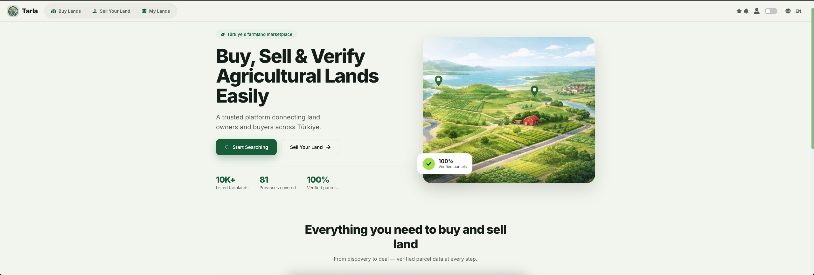

# Tarla — Frontend



> This repository is the **frontend** part of the project. The backend lives in a separate repository: [tarla-backend-node](https://github.com/gunesozdogan/tarla-backend-node).

Web application for listing, discovering and managing farmlands (tarla) in Turkey. Users browse parcels on an interactive map, list their own land for sale, save favorites, view per‑listing analytics, and manage everything from a personalized dashboard. Parcel boundaries and cadastral data (ada/parsel) are sourced from Turkey's TKGM system on the backend.

This repository contains the **React single‑page frontend**. It talks to a separate Node/Express + PostgreSQL backend (`tarla-backend-node`) over a REST API.

---

## Tech Stack

| Area | Technology |
| --- | --- |
| Framework | React 18 (Create React App / `react-scripts` 5) |
| Routing | React Router DOM v7 |
| Maps | Leaflet, React‑Leaflet, Leaflet.markercluster |
| Charts | Chart.js + react‑chartjs‑2 |
| HTTP | Axios |
| i18n | i18next + react‑i18next (English & Turkish) |
| Icons | react‑icons |
| Turkey data | turkey‑neighbourhoods |
| Tooling | Prettier, Testing Library (Jest DOM), web‑vitals |

---

## Features

### Authentication
- **Email/password** sign up and login
- **Google OAuth** login (handled by the backend, frontend receives a token)
- **Facebook OAuth** login (same flow)
- OAuth callback handled at `/oauth-success`, which stores the JWT and user
- Session persisted in `localStorage` with a 1‑hour expiry
- **Protected routes** — unauthenticated users are redirected/shown a login warning
- **Role‑based access** — admin users get a dedicated navbar and admin pages

### Listings
- **Create** a listing with location (province / district / neighborhood), size, price, photos and details
- **Edit** and **delete** your own listings
- **My Listings** dashboard
- **Listing detail** page with full information and parcel geometry
- **Search** listings with filters
- **Boosted** listings support
- **Favorites** — save and manage listings you like

### Map experience
- Interactive Leaflet map centered on Turkey
- **Marker clustering** for dense areas
- **Satellite / standard** view toggle
- **"Locate me"** button using browser geolocation
- Fetches fields dynamically based on the visible map bounds
- Renders real parcel polygons (GeoJSON) from cadastral data

### Analytics
- Per‑listing analytics page with charts (views, price history, etc.) powered by Chart.js

### Other
- **Notifications** page
- **Profile** management
- **Dark mode** toggle (persisted in `localStorage`)
- **Internationalization** — full English and Turkish translations
- **Admin panel** — manage fields, dashboard and incoming requests

---

## Project Structure

```
src/
├── App.jsx                 # Root component: routing, auth state, navbar/footer
├── index.jsx               # Entry point (i18n + React DOM)
├── i18n.js                 # i18next setup (en / tr)
├── ProtectedRoute.jsx      # Guard for authenticated-only routes
├── 0AuthSuccess.jsx        # OAuth callback handler (stores token + user)
├── FieldsView.jsx          # Main interactive map view
├── PolygonTest.jsx         # Parcel polygon rendering test
├── api/
│   └── axios.js            # Axios instance / API config
├── assets/                 # Logos, icons, marker images
├── locales/                # Translation files (en, tr)
├── components/
│   ├── Navbar/ AdminNavbar/ Footer/ Hero/ HowItWorks/
│   ├── InitialPage/ CardSection/        # Landing page
│   ├── LoginPage/ SignupPage/ LoginWarning/
│   ├── AddListing/ ListingEdit/ MyListings/ ViewDetailsPage/
│   ├── ListingSearch/ FavoritesPage/
│   ├── ListingAnalytics/                # Chart.js analytics
│   ├── NotificationPage/ ProfilePage/
│   ├── AdminFields/                     # Admin: field management
│   └── icons/ IconWrapper/
├── App.css / index.css / variables.css  # Global styles & CSS variables
└── setupTests.js           # Testing Library / jest-dom setup
```

### Routes

| Path | Page | Access |
| --- | --- | --- |
| `/` | Landing page | Public |
| `/login`, `/signup` | Auth | Public |
| `/how-it-works` | Info | Public |
| `/oauth-success` | OAuth callback | Public |
| `/search` | Listing search | Protected |
| `/add-listing` | Create listing | Protected |
| `/viewdetails/:id` | Listing detail | Protected |
| `/editlisting/:listingId` | Edit listing | Protected |
| `/mylistings` | My listings | Protected |
| `/mylistings/:fieldId/analytics` | Listing analytics | Protected |
| `/favorites` | Favorites | Protected |
| `/notifications` | Notifications | Protected |
| `/profile` | Profile | Protected |
| `/fieldsView` | Map view | Protected |
| `/admin/fields` | Field management | Admin |
| `/admin/dashboard`, `/admin/requests` | Admin pages | Admin |

---

## Getting Started

### Prerequisites
- Node.js >= 18
- The backend (`tarla-backend-node`) running locally on port **4000**

### Install & run

```bash
npm install
npm start
```

The app runs on **http://localhost:3001**. In development, API requests are forwarded to the backend via the `proxy` setting in `package.json` (`http://localhost:4000`).

### Environment variables

| Variable | Used in | Description |
| --- | --- | --- |
| `REACT_APP_API_BASE_URL` | Production | Absolute backend URL (set in `.env.production` / Railway). Not needed locally — the dev proxy handles it. |

---

## Scripts

| Command | Description |
| --- | --- |
| `npm start` | Run the dev server on port 3001 |
| `npm run build` | Production build into `build/` |
| `npm test` | Run tests in watch mode |
| `npm run format` | Format the codebase with Prettier |
| `npm run format:check` | Check formatting without writing |

---

## Deployment

The app builds to a static bundle and is configured for Railway (`railway.toml`). Set `REACT_APP_API_BASE_URL` to the deployed backend URL in the Railway environment before building.